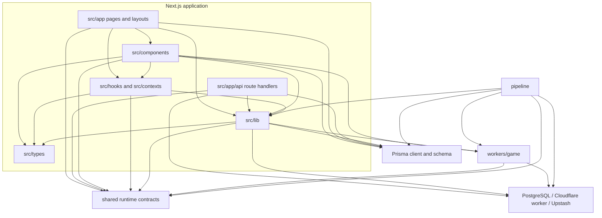

# Module dependencies

This map describes the current compile/deployment boundaries. Arrows mean
“imports or calls.” It is intentionally coarser than a per-file graph; the
source examples below are the stable entry points for verifying each edge.

## Boundary notes

- `shared/` is the runtime-neutral contract boundary intentionally consumed by
  both the application and game worker. It is not the only worker source the
  application compiles: the root `@engine/*` alias points into
  `workers/game/src/*`. See [`shared/README.md`](../../shared/README.md).
- `workers/game/` owns authoritative game mutation and Durable Object state;
  live games reach the deployed worker through `src/lib/game-worker/client.ts`
  and WebSocket hooks. There are also deliberate source-level imports from the
  app: `src/lib/game/card-data.ts` reuses the worker's narrowed `CardData` type
  and runtime `parseCardData` validator, while sandbox library modules share
  engine-only card/effect types. The sandbox UI additionally runs
  `runPipeline` in the browser so playground scenarios exercise the real engine
  without a Durable Object. These `LIB --> WORKER` and `UI --> WORKER` edges are
  therefore type/data sharing plus sandbox execution, not the live game's
  authoritative mutation path.
- Server pages under `src/app/` and the server component
  `src/components/cards/set-browser.tsx` import the Prisma singleton directly;
  API handlers and library modules do so as well.
- `pipeline/transform.ts` imports shared card parsing. Pipeline database stages
  use Prisma independently of the Next.js application;
  `pipeline/sync-effect-schemas.ts` also reads worker schemas and app deck
  validation, and `pipeline/migrate-images.ts` fetches source images and calls
  Cloudflare R2 directly through the S3 client.
- `src/types/` is app-scoped. Worker-narrowed types remain in
  `workers/game/src/types.ts`.

## Current integration seams

Feature composition introduces a few deliberate cross-layer imports inside the
Next.js box: realtime hooks consume the user-channel provider, card-browser data
uses a component prop type, sandbox tests hydrate through component adapters,
and client legality reads the active-effects context. These are visible in
`src/hooks/use-remote-game-status.ts`, `src/hooks/use-lobby-room.ts`,
`src/lib/cards/browser.ts`, `src/lib/sandbox/scenarios/__tests__/manifest.test.ts`,
and `src/lib/game/client-legality.ts`; do not assume a stricter internal DAG than
the imports provide.

For service topology and request flows, see
[`ARCHITECTURE.md`](./ARCHITECTURE.md). For the game engine's internal action
pipeline, see [`docs/game-engine/08-ENGINE-ARCHITECTURE.md`](../game-engine/08-ENGINE-ARCHITECTURE.md).
