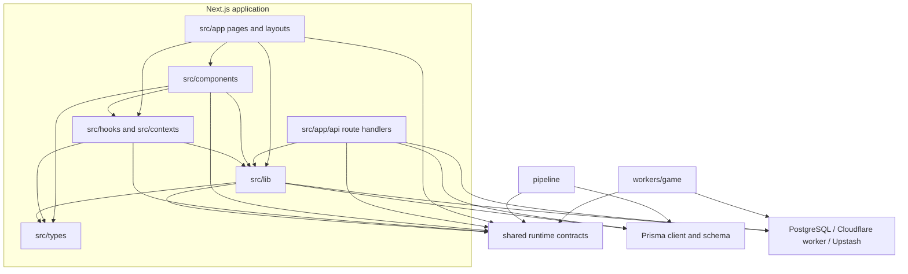

# Module dependencies

This map describes the current compile/deployment boundaries. Arrows mean
“imports or calls.” It is intentionally coarser than a per-file graph; the
source examples below are the stable entry points for verifying each edge.

## Boundary notes

- `shared/` is the only source boundary compiled directly by both application
  and game worker. See [`shared/README.md`](../../shared/README.md).
- `workers/game/` owns authoritative game mutation and Durable Object state;
  the app reaches it through `src/lib/game-worker/client.ts` and WebSocket hooks.
- `src/lib/game/` contains app-side conversion, legality, targeting, token, and
  finalization helpers. It does not import the worker engine.
- `pipeline/transform.ts` imports shared card parsing; pipeline database stages
  use Prisma independently of the Next.js application.
- `src/types/` is app-scoped. Worker-narrowed types remain in
  `workers/game/src/types.ts`.

## Current integration seams

Feature composition introduces a few deliberate cross-layer imports inside the
Next.js box: realtime hooks consume the user-channel provider, card-browser data
uses a component prop type, sandbox tests hydrate through component adapters,
and client legality reads the active-effects context. These are visible in
`src/hooks/use-remote-game-status.ts`, `src/hooks/use-lobby-room.ts`,
`src/lib/cards/browser.ts`, `src/lib/sandbox/scenarios/__tests__/manifest.test.ts`,
and `src/lib/game/client-legality.ts`; do not assume a stricter internal DAG than
the imports provide.

For service topology and request flows, see
[`ARCHITECTURE.md`](./ARCHITECTURE.md). For the game engine's internal action
pipeline, see [`docs/game-engine/08-ENGINE-ARCHITECTURE.md`](../game-engine/08-ENGINE-ARCHITECTURE.md).
