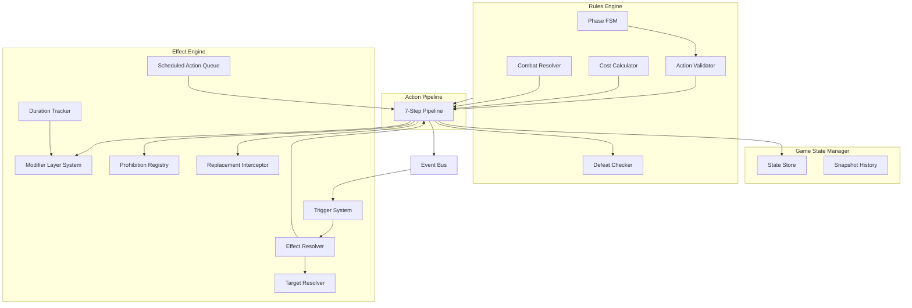
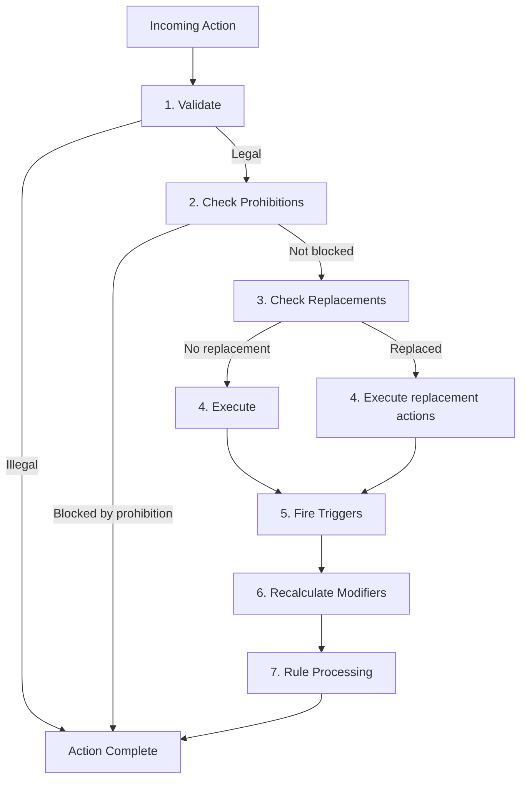
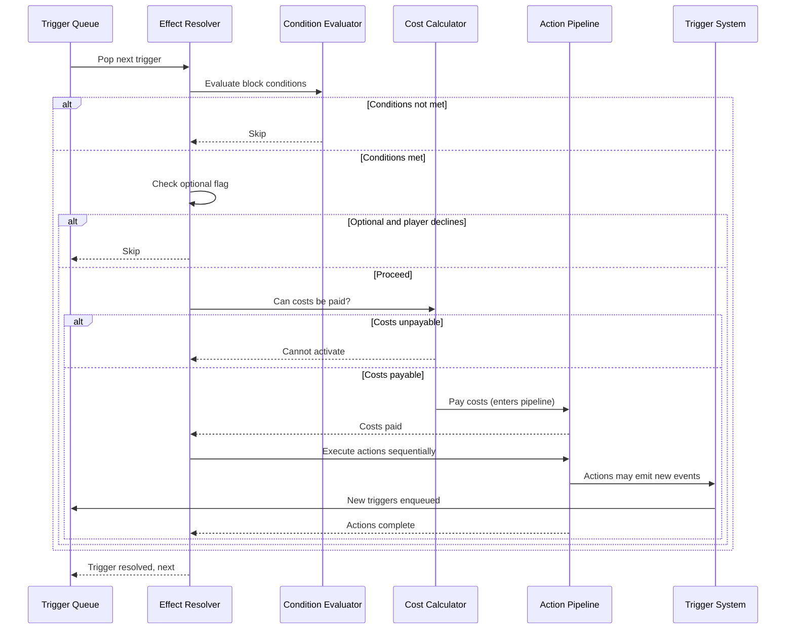
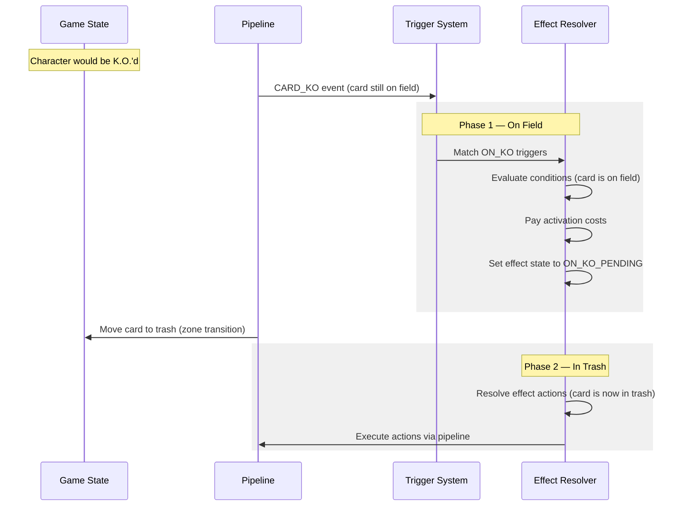

# 08 — Engine Architecture

> High-level game engine design for OPTCG effect processing. Describes how the engine processes effects — component relationships, data flow, and resolution semantics. For what effects ARE, see the schema docs (01-07). For the comprehensive rules mapping, see [Game Engine Requirements](./GAME-ENGINE-REQUIREMENTS.md).

**Related docs:** [Schema Overview](./01-SCHEMA-OVERVIEW.md) · [Actions](./04-ACTIONS.md) · [Triggers](./02-TRIGGERS.md) · [Prohibitions & Replacements](./06-PROHIBITIONS-AND-REPLACEMENTS.md)

---

## Architectural Principles

1. **Immutable state snapshots.** Every game state is a complete, frozen snapshot. Mutations produce a new snapshot rather than modifying the previous one. This enables undo, replay, rollback on failed cost payment, and deterministic server-client reconciliation.

2. **Single action pipeline.** Every game mutation — player actions, rule processing, effect resolution — flows through the same seven-step pipeline. There is no backdoor. This guarantees that prohibitions, replacements, triggers, and modifiers are always evaluated, regardless of what initiated the change.

3. **Modifier layer system.** Power, cost, and keyword state are never stored as mutated values on the card. Instead, the engine recalculates them from the base printed value through an ordered layer stack on every read. This eliminates stale-modifier bugs and makes duration expiry trivial.

4. **Event bus with trigger scanning.** Every action that completes step 4 (execution) emits a typed game event. The trigger system subscribes to these events and scans all registered triggers for matches. This decouples effect authoring from engine internals — new trigger types require a new event emission, not new engine code paths.

5. **Prohibition registry with veto semantics.** Active prohibitions are registered in a flat, scannable collection. Before any action executes, the engine scans this registry for matching vetoes. A single match is sufficient to block the action. Per comprehensive rules 1-3-3, prohibitions always override instructions.

---

## Core Components



### Component Responsibilities

| Component | Responsibility |
|-----------|---------------|
| **State Store** | Holds the current immutable game state snapshot. Produces new snapshots on mutation. |
| **Snapshot History** | Ordered list of prior snapshots for undo, replay, and rollback. |
| **Phase FSM** | Finite state machine governing the turn phase sequence: REFRESH, DRAW, DON, MAIN, END. Tracks sub-states for battle (ATTACK_STEP through END_OF_BATTLE). |
| **Action Validator** | Checks whether a proposed action is legal in the current phase and game state, before it enters the pipeline. |
| **Combat Resolver** | Manages the battle sub-state machine: attacker/target tracking, power comparison, damage application, bail-out checks. |
| **Cost Calculator** | Computes effective costs for playing cards and activating effects, accounting for cost modifiers and the modifier layer system. |
| **Defeat Checker** | Evaluates state-based loss conditions (life-out, deck-out) after every pipeline execution. |
| **Trigger System** | Registers, matches, and queues triggers from active effect blocks when game events are emitted. |
| **Effect Resolver** | Resolves a queued trigger or activated effect: evaluates conditions, pays costs, executes the action chain. |
| **Target Resolver** | Evaluates target specifications against the current game state, applying filters, count constraints, and aggregate constraints. |
| **Modifier Layer System** | Computes effective power and cost for any card by applying ordered modifier layers to the base printed value. |
| **Prohibition Registry** | Flat collection of active "cannot X" restrictions, scanned at pipeline step 2. |
| **Replacement Interceptor** | Scans for active replacement effects at pipeline step 3, substituting original actions when a match is found. |
| **Duration Tracker** | Tracks active continuous effects and their expiry conditions. Processes expiry waves at phase boundaries. |
| **Scheduled Action Queue** | Priority queue of deferred actions (end-of-turn obligations, future-phase triggers) processed at their designated timing. |
| **Event Bus** | Typed event dispatcher. Actions emit events; the trigger system and other observers subscribe. |

---

## Game State Model

The immutable state snapshot. Every field is read-only after creation. Mutations produce a new `GameState` with the changed fields.

```typescript
interface GameState {
  id: string;
  turn: TurnState;
  players: [PlayerState, PlayerState];
  battle: BattleContext | null;
  activeEffects: ActiveEffect[];
  prohibitions: ActiveProhibition[];
  scheduledActions: ScheduledActionEntry[];
  oneTimeModifiers: ActiveOneTimeModifier[];
  triggerRegistry: RegisteredTrigger[];
  eventLog: GameEvent[];
}

interface TurnState {
  number: number;
  activePlayerIndex: 0 | 1;
  phase: Phase;
  battleSubPhase: BattleSubPhase | null;
  oncePerTurnUsed: Map<string, Set<string>>;
  actionsPerformedThisTurn: PerformedAction[];
  extraTurnsPending: number;
}

type Phase =
  | "REFRESH"
  | "DRAW"
  | "DON"
  | "MAIN"
  | "END";

type BattleSubPhase =
  | "ATTACK_STEP"
  | "BLOCK_STEP"
  | "COUNTER_STEP"
  | "DAMAGE_STEP"
  | "END_OF_BATTLE";
```

### Player State

```typescript
interface PlayerState {
  playerId: string;
  leader: CardInstance;
  characters: CardInstance[];       // max 5
  stage: CardInstance | null;       // max 1
  donCostArea: DonInstance[];
  hand: CardInstance[];
  deck: CardInstance[];             // ordered, index 0 = top
  trash: CardInstance[];            // ordered, index 0 = top (most recent)
  donDeck: DonInstance[];
  life: LifeCard[];                 // ordered, index 0 = top
}

interface CardInstance {
  instanceId: string;               // unique per game life, reset on zone change
  cardId: string;                   // card identity (links to card database)
  zone: Zone;
  state: "ACTIVE" | "RESTED";
  attachedDon: DonInstance[];
  turnPlayed: number | null;        // track when played for Rush check
  controller: 0 | 1;
  owner: 0 | 1;
}

interface LifeCard {
  instanceId: string;
  cardId: string;
  face: "UP" | "DOWN";
}

interface DonInstance {
  instanceId: string;
  state: "ACTIVE" | "RESTED";
  attachedTo: string | null;        // CardInstance.instanceId or null if in cost area
}
```

### Active Effects and Registries

```typescript
interface ActiveEffect {
  id: string;
  sourceCardInstanceId: string;
  sourceEffectBlockId: string;
  category: EffectCategory;
  modifiers: Modifier[];
  duration: Duration;
  expiresAt: ExpiryTiming;
  controller: 0 | 1;
  appliesTo: string[];              // target CardInstance.instanceIds
  timestamp: number;                // for modifier ordering
}

interface ActiveProhibition {
  id: string;
  sourceCardInstanceId: string;
  type: ProhibitionType;
  scope: ProhibitionScope;
  duration: Duration;
  controller: 0 | 1;
  usesRemaining: number | null;     // for uses_per_turn; null = unlimited
}

interface ScheduledActionEntry {
  id: string;
  timing: ScheduleTiming;
  action: Action;
  boundToInstanceId: string | null;
  sourceEffectId: string;
  controller: 0 | 1;
}

interface ActiveOneTimeModifier {
  id: string;
  appliesTo: { action: ActionType; filter?: TargetFilter };
  modification: Modifier;
  expires: Duration;
  consumed: boolean;
  controller: 0 | 1;
}

interface RegisteredTrigger {
  id: string;
  sourceCardInstanceId: string;
  effectBlockId: string;
  trigger: Trigger;
  zone: EffectZone;
  controller: 0 | 1;
}
```

---

## Action Pipeline

Every game mutation flows through this seven-step pipeline. No exceptions. Player actions, rule-based actions, effect-generated actions, and scheduled actions all enter at step 1.



### Step 1 — Validate

Check whether the proposed action is legal in the current game state and phase.

- Is it the correct player's turn to act?
- Is the current phase/sub-phase compatible with this action type? (e.g., [Activate: Main] cannot be used during battle per rules 10-2-2-1)
- Does the player have the resources to pay costs?
- Are targets valid and selectable?
- For "up to N" selections, is the chosen count within range?

If invalid, the action is rejected. No state change, no events emitted.

### Step 2 — Check Prohibitions

Scan the prohibition registry for any active prohibition that matches this action.

- Iterate all `ActiveProhibition` entries.
- For each, check: does the prohibition type match this action type? Does the scope (cause, source_filter, duration) apply to this specific action context?
- If any prohibition matches, the action is vetoed. Per rules 1-3-3, prohibition always wins.
- For prohibitions with `usesRemaining`, decrement the counter when the prohibition blocks an action.
- For prohibitions with `conditional_override`, prompt the affected player to optionally pay the override cost.

### Step 3 — Check Replacements

Scan for active replacement effects that intercept this action.

- Iterate all `replacement` category EffectBlocks in the active effects registry.
- Match the `replaces.event` against the action being performed.
- If `replaces.target_filter` is present (proxy replacement), match it against the card being affected.
- If `replaces.cause_filter` is present, match it against the source of the action.
- Evaluate block-level conditions on the replacement EffectBlock.
- If multiple replacements match, apply priority per rules 8-1-3-4-3:
  1. Replacement from the card that generated the situation
  2. Turn player's replacements (turn player chooses order)
  3. Non-turn player's replacements (non-turn player chooses order)
- If the selected replacement has `flags.optional`, prompt the controller.
- If a replacement is selected, cancel the original action. The replacement's `replacement_actions` enter the pipeline as new actions (starting at step 1). The replaced action does not fire triggers or update modifiers.
- A replacement effect cannot intercept the same event more than once per occurrence (prevents loops, per rules 8-1-3-4-3).

### Step 4 — Execute

Perform the state change. Produce a new `GameState` snapshot.

- Zone transitions strip all modifiers from the moved card and assign a new `instanceId` (per rules 3-1-6).
- DON!! cards moving between any areas lose all effects (per rules 3-1-6-1).
- Area overflow rules are enforced here (5-card Character limit, 1-card Stage limit). Overflow trashing is rule processing that bypasses the effect system entirely (per rules 3-7-6-1-1).
- Impossible actions are silently ignored, not errors (per rules 1-3-2).
- If an action would simultaneously rest and activate a card, resting wins (per rules 1-3-8).

### Step 5 — Fire Triggers

Emit a typed `GameEvent` onto the event bus. Then scan the trigger registry for matches.

- The event carries metadata: action type, source card, target card(s), cause, controller, zone transitions, battle context.
- The trigger system scans all `RegisteredTrigger` entries against the event (see [Trigger System](#trigger-system)).
- Matched triggers are collected, ordered, and queued for resolution.
- Trigger resolution may enqueue new actions that re-enter the pipeline at step 1.

### Step 6 — Recalculate Modifiers

Recompute power, cost, and keyword state for all cards that may have been affected.

- Run the [Modifier Layer System](#modifier-layer-system) for each card with active effects.
- Check `WHILE_CONDITION` durations — if a condition is no longer met, mark the effect for expiry.
- Check `ActiveOneTimeModifier` entries — if a modifier was consumed this action, remove it.

### Step 7 — Rule Processing

Evaluate state-based actions that the game rules mandate.

- **Zero-power check:** If any Character has 0 or less power after modifier recalculation, it is K.O.'d. This K.O. enters the pipeline as a new action. Note: power can be negative (per rules 1-3-6-1), and zero-power KO is a state-based action, not an instantaneous check.
- **Deck-out check:** If any player has 0 cards in their deck, that player loses (per rules 9-2-1-2).
- **Life-out check:** If any player has 0 Life cards and their Leader took damage during this action sequence, that player loses (per rules 7-1-4-1-1-1). The check is: damage determined AND 0 Life at point of damage determination.
- **Simultaneous defeat:** If both players meet a defeat condition, the game is a draw (per rules 9-2-1).
- **Infinite loop detection:** If the game state hash repeats within a resolution sequence, invoke loop resolution (per rules 11-1).

---

## Event Bus

Every completed action (step 4) emits one or more typed events. Events are the sole interface between the action pipeline and the trigger system.

### Event Categories

**Card Zone Transitions**

| Event | Emitted When |
|-------|-------------|
| `CARD_PLAYED` | A card enters the field from any zone via play. Carries `source_zone` and `play_method`. |
| `CARD_KO` | A Character or Stage is K.O.'d (battle or effect). Carries `cause`: `BATTLE`, `EFFECT`, `OPPONENT_EFFECT`. |
| `CARD_TRASHED` | A card is trashed (not K.O. — no On K.O. triggers). Carries `source_zone`. |
| `CARD_RETURNED_TO_HAND` | A card is bounced from field to hand. |
| `CARD_RETURNED_TO_DECK` | A card is placed from field to deck (top or bottom). |
| `CARD_DRAWN` | A card is drawn from deck to hand. |
| `CARD_MILLED` | A card is moved from deck to trash. |
| `CARD_SEARCHED` | A card is selected from deck (via search) and added to hand. |
| `CARD_REVEALED` | A card's identity is made public. |

**Life Area**

| Event | Emitted When |
|-------|-------------|
| `CARD_REMOVED_FROM_LIFE` | A Life card leaves the Life area (by damage, effect, or any cause). |
| `CARD_ADDED_TO_LIFE` | A card enters the Life area from any source. |
| `CARD_ADDED_TO_HAND_FROM_LIFE` | A Life card is added to hand (typically via damage). |
| `LIFE_CARD_FACE_CHANGED` | A Life card's face orientation changes (face-up/face-down). |

**Damage**

| Event | Emitted When |
|-------|-------------|
| `DAMAGE_DEALT` | Damage is dealt to a player (combat or effect). Carries `amount` and `source`. |
| `DAMAGE_TAKEN` | A player takes damage. |

**DON!!**

| Event | Emitted When |
|-------|-------------|
| `DON_PLACED_ON_FIELD` | DON!! moves from DON!! deck to cost area (DON!! Phase). |
| `DON_RETURNED_TO_DON_DECK` | DON!! returns from field to DON!! deck (cost payment or effect). |
| `DON_GIVEN_TO_CARD` | DON!! is attached to a Leader or Character. |
| `DON_DETACHED` | DON!! is removed from a card and returned to cost area. |
| `DON_REDISTRIBUTED` | DON!! moves from one card to another. |
| `DON_STATE_CHANGED` | DON!! changes between active and rested. |

**Battle**

| Event | Emitted When |
|-------|-------------|
| `ATTACK_DECLARED` | A card is declared as attacker, target selected. Carries `attacker` and `target`. |
| `BLOCK_DECLARED` | Blocker is activated, replacing the attack target. |
| `COUNTER_USED` | A Symbol Counter or Counter Event is activated during Counter Step. |
| `BATTLE_RESOLVED` | The damage step completes (attacker wins or loses). |
| `ATTACK_REDIRECTED` | Attack target is changed mid-battle by effect. |

**Effect Activation**

| Event | Emitted When |
|-------|-------------|
| `EVENT_ACTIVATED_FROM_HAND` | An Event card is played and its [Main] resolves from hand. |
| `EVENT_MAIN_RESOLVED_FROM_TRASH` | A Character activates an Event's [Main] effect from trash. |
| `EVENT_TRIGGER_RESOLVED` | An Event card's [Trigger] effect resolves from Life. |
| `TRIGGER_ACTIVATED` | A [Trigger] effect is activated from a revealed Life card. |
| `BLOCKER_ACTIVATED` | A [Blocker] keyword is activated. |
| `EFFECT_ACTIVATED` | Any effect on a card activates (auto, activate, or permanent becoming valid). |

**State Changes**

| Event | Emitted When |
|-------|-------------|
| `CARD_STATE_CHANGED` | A card transitions between active and rested. Carries `cause`. |
| `POWER_MODIFIED` | A card's power changes (additive/subtractive modifier applied). |
| `COST_MODIFIED` | A card's cost changes. |
| `BASE_POWER_SET` | A card's base power is overridden. |
| `KEYWORD_GRANTED` | A keyword is granted to a card. |
| `EFFECTS_NEGATED` | A card's effects are negated (blanked). |
| `PROHIBITION_APPLIED` | A new prohibition enters the registry. |
| `PROHIBITION_REMOVED` | A prohibition is removed from the registry. |

**Turn Structure**

| Event | Emitted When |
|-------|-------------|
| `PHASE_CHANGED` | The game transitions to a new phase. Carries `from` and `to`. |
| `TURN_STARTED` | A new turn begins (triggers "at the start of your turn" effects). |
| `TURN_ENDED` | A turn completes (after End Phase processing). |
| `DECK_SHUFFLED` | A deck is shuffled. |
| `HAND_REVEALED` | A player's hand is revealed to the opponent. |
| `GAME_OVER` | A player wins, loses, or the game draws. |

---

## Trigger System

The trigger system connects game events to card effects. It operates as a four-stage pipeline: registration, matching, ordering, and resolution.

### Registration

When a card enters a zone where its effects are valid, the engine registers all `auto` and `activate` category EffectBlocks from that card's schema into the `triggerRegistry`.

- On entering the field (Leader area, Character area, Stage area): register all EffectBlocks with `zone: "FIELD"` (or no explicit zone).
- On entering the hand: register all EffectBlocks with `zone: "HAND"`.
- On zone exit: deregister all triggers sourced from that card's `instanceId`.
- Zone transitions produce a new `instanceId`, so returning a card and replaying it creates fresh registrations (resets Once Per Turn, per rules 3-1-6).

### Matching

When a `GameEvent` is emitted at pipeline step 5, the engine scans all `RegisteredTrigger` entries:

1. **Event type match.** Does the trigger's event type (keyword or custom) match the emitted event?
2. **Turn restriction.** If `turn_restriction` is present, does the current turn owner match?
3. **DON!! requirement.** If `don_requirement` is present, does the source card have at least N attached DON!!?
4. **Event filter.** If the trigger has a `filter` (controller, cause, target_filter, etc.), does the event's metadata satisfy it?
5. **Quantity threshold.** If `quantity_threshold` is present (e.g., "2 or more DON!! returned"), does the event count meet or exceed it?
6. **Zone validity.** Is the source card still in a zone where the effect is valid? (Per rules 8-1-3-1-3, if the card moved before the trigger fires, the effect cannot activate.)
7. **Once Per Turn.** Has this effect already been used this turn on this card instance?
8. **Compound triggers.** For `CompoundTrigger`, evaluate each `any_of` entry independently. Fire if any one matches. Do not fire multiple times for a single event.

### Ordering

Matched triggers are ordered for resolution per rules 8-6:

1. **Turn player's triggers first.** All triggers controlled by the turn player resolve before the non-turn player's.
2. **Within a player's triggers, the player chooses order.** The engine prompts the player to arrange their simultaneous triggers.
3. **During damage processing.** Effects triggered during damage processing wait until ALL damage processing completes before activating (per rules 8-6-2). Exception: [Trigger] effects from revealed Life cards suspend damage processing and resolve immediately (per rules 8-6-2-1).
4. **Nested triggers.** If a turn player's effect triggers during resolution of the turn player's earlier effect, the non-turn player's pending effect resolves first, then the newly triggered turn player effect (per rules 8-6 paragraph 2).

### Resolution

For each trigger in the ordered queue:



1. **Condition evaluation.** Check block-level conditions against current game state. If not met, skip.
2. **Optional check.** If `flags.optional` is true, prompt the controller. If they decline, skip.
3. **Cost payment.** Verify costs are payable. Pay them via the action pipeline. If payment fails mid-way (per rules 8-3-1-3-1), the partial cost is consumed but the effect does not resolve. Once Per Turn is still consumed.
4. **Action chain execution.** Execute the `actions` array sequentially, respecting chain connectors:
   - `THEN`: execute the next action regardless of prior success.
   - `IF_DO`: execute only if the prior action successfully resolved (produced a result).
   - `AND`: execute simultaneously with the prior action (atomic).
5. **Inline conditions.** Individual actions with their own `conditions` field are gated by those conditions independently.
6. **Back-references.** Actions using `target_ref` resolve their target from the `result_ref` stored by a prior action in the chain.
7. **Re-triggering.** Each action in the chain enters the pipeline at step 1, which may emit events and trigger additional effects. These nested triggers are queued per the ordering rules above.

---

## Modifier Layer System

Power and cost are never stored as mutated values. They are computed fresh for every read by applying an ordered stack of modifier layers to the base printed value.

### Layer Order

```
Layer 0: Base printed value (from card database)
   |
Layer 1: Base-setting effects ("base power becomes X")
   |
Layer 2: Additive/subtractive modifiers (applied in timestamp order)
   |
Layer 3: Set-to-zero effects (special handling per rules 4-12)
   |
DON!! bonus: +1000 per attached DON!! (owner's turn only)
   |
= Effective value
```

### Layer 0 — Base Printed Value

The card's power or cost as printed. This is the starting point. Always retrieved from the card database, never modified in place.

### Layer 1 — Base-Setting Effects

Effects that override the base value: "base power becomes 7000", "set base power to 0".

- When multiple base-setting effects are active on the same card, the **highest value wins** (per rules 4-9-2-1).
- Base-setting effects replace the layer 0 value for all subsequent layers.
- Applied before additive/subtractive modifiers.

### Layer 2 — Additive/Subtractive Modifiers

Standard "+N power" and "-N power" effects. Applied in **timestamp order** — the order in which the effects were created.

- Each `ActiveEffect` with power/cost modifiers has a `timestamp` field.
- Iterate modifiers sorted by ascending timestamp.
- Accumulate the sum of all additive/subtractive modifications.
- Power can go negative. The engine does not clamp power (per rules 1-3-6-1).
- Cost cannot go below 0 for payment purposes, but the internal calculated value can be negative during computation (per rules 1-3-5-1, 1-3-6-2).

### Layer 3 — Set-to-Zero

"Set power to 0" is not a true base-setting effect. Per rules 4-12, it is implemented as: apply a modifier equal to `-(current effective power at the time of activation)`. The modifier is locked at activation time.

- If the card's effective power at activation is already 0 or negative, no modifier is applied (per rules 4-12-2).
- The modifier is a fixed negative value, not a live recalculation. Subsequent buffs or debuffs apply on top of it.

### DON!! Bonus

+1000 per attached DON!! card, but **only during the owner's turn** (per rules 6-5-5-2).

```
if (currentTurnPlayer === cardOwner) {
  effectiveValue += attachedDonCount * 1000;
}
```

DON!! remain attached through the opponent's turn (they return during the owner's Refresh Phase per rules 6-2-3), but they grant no power bonus until the owner's turn resumes.

### Recalculation Timing

The modifier layer system recalculates after every action in the pipeline (step 6). Specifically:

- After any `MODIFY_POWER`, `SET_BASE_POWER`, `MODIFY_COST`, `SET_POWER_TO_ZERO`, `COPY_POWER`, `SWAP_BASE_POWER`, `SET_COST` action.
- After any zone transition (modifiers are stripped per rules 3-1-6).
- After DON!! attachment or detachment.
- After duration expiry removes an `ActiveEffect`.
- After a `WHILE_CONDITION` effect's condition changes truth value.

### Cost Calculation

Cost follows the same layer model as power, with one additional rule: the effective cost is clamped to a minimum of 0 for payment purposes.

```
effectiveCost = max(0, baseCost + sum(costModifiers))
```

One-time modifiers (the "next time you play X, cost reduced by N" pattern from [Schema Overview](./01-SCHEMA-OVERVIEW.md)) are checked at play time. If the card being played matches the one-time modifier's `applies_to` filter, the modifier is applied and consumed.

---

## Replacement Interceptor

Replacement effects are checked at step 3 of the pipeline, after prohibition checks (step 2) but before execution (step 4). They substitute a different outcome for the action about to occur.

### Matching

For each pending action, the interceptor:

1. Scans all active `replacement` category EffectBlocks.
2. Matches `replaces.event` against the action type:
   - `WOULD_BE_KO` matches KO actions (from battle or effect).
   - `WOULD_BE_REMOVED_FROM_FIELD` matches KO-by-effect, bounce, deck-tuck, and trash actions.
   - `WOULD_LEAVE_FIELD` matches all zone transitions away from the field.
   - `WOULD_BE_RESTED` matches state change to rested.
   - `WOULD_LOSE_GAME` matches defeat judgment.
   - `LIFE_ADDED_TO_HAND` matches the Life damage rule.
3. Applies `target_filter` (for proxy replacements) against the card being affected.
4. Applies `cause_filter` against the action's source.
5. Evaluates block-level `conditions` on the replacement EffectBlock.

### Priority

When multiple replacement effects match the same event (per rules 8-1-3-4-3):

1. **Controller chooses.** The controller of the affected card selects which replacement to apply.
2. **Source card priority.** If the card being affected has its own replacement effect, that takes priority.
3. **Turn player second.** Among external replacement effects, the turn player's are offered first.
4. **Non-turn player last.** Then the non-turn player's.

### Execution

- The selected replacement's `replacement_actions` enter the pipeline as new actions.
- The original action is discarded entirely — it does not execute, does not fire triggers, does not modify state.
- If the replacement has `costs`, the controller must pay them. If costs are unpayable, the replacement cannot apply and the next eligible replacement (or the original action) proceeds.
- If `flags.optional` is true and the controller declines, the replacement is skipped. The next eligible replacement is offered, or the original action proceeds.

### Once-Per-Event Rule

Per rules 8-1-3-4-3: once a replacement effect has been applied to a specific event occurrence, that same replacement effect cannot intercept the replacement itself. This prevents infinite loops. However, a *different* replacement effect may intercept the replacement's actions.

---

## On K.O. Two-Phase Resolution

`[On K.O.]` effects have unique resolution semantics per rules 10-2-17. The card moves zones between activation and resolution.



### Phase 1 — While Still on Field

1. The K.O. action reaches step 5 (fire triggers) while the card is still in the Character area.
2. The trigger system matches `ON_KO` triggers on the card being K.O.'d.
3. For each matched trigger:
   - Evaluate block-level **conditions** against the current state (card is on field, has its modifiers, has attached DON!!).
   - If optional, prompt the player.
   - **Pay activation costs** (DON!! return, self-rest, etc.) while the card is still on field.
   - Mark the effect as `ON_KO_PENDING`.

### Transition

4. Move the card from the Character area to the trash. This is a zone transition: the card gets a new `instanceId`, all modifiers are stripped.
5. Attached DON!! are returned to the cost area and rested (per rules 6-5-5-4).

### Phase 2 — While in Trash

6. Resolve the effect's `actions` array. The source card is now in the trash.
7. Actions that reference "this card" point to the card in its new location (trash).
8. If a `cause` qualifier exists on the ON_KO trigger (e.g., `OPPONENT_EFFECT`), the cause was already verified in Phase 1.

### Key Distinction

Regular auto effects (like `[On Play]`) require the card to be in its valid zone at both activation and resolution time. `[On K.O.]` is the explicit exception: activation happens on field, resolution happens in trash. The engine must not deregister the trigger between these two phases.

---

## Duration Tracking

The duration tracker manages the lifecycle of all continuous effects: creation, persistence, and expiry.

### Active Effects Registry

Each continuous effect produced by the action pipeline is recorded as an `ActiveEffect` entry:

```typescript
interface ActiveEffect {
  id: string;
  sourceCardInstanceId: string;
  sourceEffectBlockId: string;
  modifiers: Modifier[];
  duration: Duration;
  expiresAt: ExpiryTiming;
  timestamp: number;
  controller: 0 | 1;
  appliesTo: string[];
}

type ExpiryTiming =
  | { wave: "END_OF_END_PHASE"; turn: number }
  | { wave: "END_OF_TURN"; turn: number }
  | { wave: "REFRESH_PHASE"; turn: number }
  | { wave: "END_OF_BATTLE"; battleId: string }
  | { wave: "SOURCE_LEAVES_ZONE" }
  | { wave: "CONDITION_FALSE" }
  | { wave: "NEVER" };
```

### Expiry Waves

The engine processes duration expiry in three ordered waves, per rules 6-6-1-2 and 6-6-1-3. Within each wave, the turn player's effects expire first, then the non-turn player's.

**Wave 1 — End of End Phase** (processed during End Phase, after all end-of-turn triggers resolve)

| Duration Type | Expires Here |
|--------------|-------------|
| `UNTIL_END_OF_OPPONENT_NEXT_END_PHASE` | When the turn it targets ends |

**Wave 2 — End of Turn** (processed at the end of End Phase, after Wave 1)

| Duration Type | Expires Here |
|--------------|-------------|
| `THIS_TURN` | End of the current turn |

Exact processing order within the End Phase (per rules 6-6):
1. Turn player's `[End of Your Turn]` effects activate and resolve.
2. Non-turn player's `[End of Your Opponent's Turn]` effects activate and resolve.
3. Process scheduled actions with timing `END_OF_THIS_TURN`.
4. Turn player's "until the end of the turn" / "until the end of the End Phase" effects expire (Wave 1).
5. Non-turn player's same effects expire (Wave 1).
6. Turn player's "during this turn" effects expire (Wave 2).
7. Non-turn player's "during this turn" effects expire (Wave 2).

**Wave 3 — Refresh Phase** (processed at the start of the next turn's Refresh Phase)

| Duration Type | Expires Here |
|--------------|-------------|
| `UNTIL_START_OF_YOUR_NEXT_TURN` | When the source controller's Refresh Phase begins |
| `SKIP_NEXT_REFRESH` | After the next Refresh Phase that would untap this card. The card is excluded from the untap step once, then the effect expires. |

### Battle Duration

| Duration Type | Expires When |
|--------------|-------------|
| `THIS_BATTLE` | At the End of Battle step. Turn player's battle-scoped effects expire first, then non-turn player's (per rules 7-1-5). |

### Permanent and Conditional Durations

| Duration Type | Lifecycle |
|--------------|----------|
| `PERMANENT` | Active as long as the source card is in its valid zone. Removed on zone transition (the `SOURCE_LEAVES_ZONE` expiry). |
| `WHILE_CONDITION` | Rechecked at step 6 of the pipeline. If the condition evaluates to false, the effect is removed. If it becomes true again later, the engine re-evaluates (permanent effects with conditions are continuously active/inactive). |

### Scheduled Actions

Distinct from duration expiry. Scheduled actions are deferred obligations created by effects, not passive modifiers.

```typescript
interface ScheduledActionEntry {
  timing: ScheduleTiming;
  action: Action;
  boundToInstanceId: string | null;
  sourceEffectId: string;
}
```

Processing:
- `END_OF_THIS_TURN`: processed during End Phase step 3 (after end-of-turn triggers, before duration expiry).
- `END_OF_THIS_BATTLE`: processed during the End of Battle step, before battle-scoped duration expiry.
- `START_OF_NEXT_MAIN_PHASE` / `START_OF_OPPONENT_NEXT_MAIN_PHASE`: processed at the start of the specified Main Phase.

If `boundToInstanceId` is set (temporary play patterns like OP11-092 Helmeppo), the action targets the specific card instance created by the originating effect. If that card is no longer on the field (already removed), the scheduled action is discarded.

### One-Time Modifiers

Pending modifiers that apply exactly once to the next matching action, then expire (per [Schema Overview](./01-SCHEMA-OVERVIEW.md) — "Next Time" One-Shot Modifiers).

```typescript
interface ActiveOneTimeModifier {
  appliesTo: { action: ActionType; filter?: TargetFilter };
  modification: Modifier;
  expires: Duration;
  consumed: boolean;
}
```

When a matching action enters the pipeline, the one-time modifier is applied at step 4 (execution) and marked as consumed. Consumed modifiers are removed at step 6 (recalculation). If the `expires` duration elapses before the modifier is consumed, it is removed unused.

---

## Effect Resolution Order

When multiple effects trigger simultaneously, the engine uses these ordering rules (per rules 8-6).

### Simultaneous Trigger Resolution

1. **Turn player first.** The turn player's triggered effects resolve before the non-turn player's.
2. **Player-chosen order.** When a player has multiple simultaneous triggers, they choose the resolution order.
3. **Nested triggers.** If effect A (turn player's) triggers effect B (also turn player's) during resolution:
   - If the non-turn player has a pending trigger, it resolves first.
   - Then the newly triggered effect B resolves.
   - This prevents the turn player from "stacking" triggers to delay the opponent's effects indefinitely.

### Damage Processing

Per rules 8-6-2:
- Effects triggered during damage processing (life removal, damage events) wait until all damage processing completes.
- Exception: `[Trigger]` effects on revealed Life cards suspend damage processing and resolve immediately (per rules 8-6-2-1).
- After all damage is processed and all Trigger effects resolve, the queued triggers fire in the standard turn-player-first order.

### Effect Chains

Per rules 8-6-3:
- If an effect triggers during card or effect activation, it waits until the current activation fully resolves.
- The triggering effect is queued and resolves after the current effect's action chain completes.

---

## Defeat Checking

State-based actions processed at pipeline step 7. These are checked after every atomic game action — not just at phase boundaries.

### Life-Out (Loss by Damage)

Per rules 7-1-4-1-1-1 and 9-2-1:

- Triggered when: a player has 0 Life cards AND their Leader has damage determined against it in the current action.
- The check happens at the point damage is determined, before Life cards are actually moved.
- If 0 Life at damage determination: the player whose Leader was attacked loses.

### Deck-Out (Loss by Empty Deck)

Per rules 9-2-1-2:

- Triggered when: a player has 0 cards in their deck.
- Checked after every action that could reduce deck count (draw, mill, search, etc.).
- Some cards modify this rule (e.g., OP15-022 Brook: "you do not lose when your deck has 0 cards. You lose at the end of the turn in which your deck becomes 0 cards."). These are `rule_modification` category effects that override the default defeat judgment.

### Zero-Power K.O.

- Characters with 0 or less effective power are K.O.'d as a state-based action.
- This is NOT triggered by power modification alone — it is checked at step 7 after modifier recalculation.
- The K.O. enters the pipeline as a new action (goes through all 7 steps, including On K.O. two-phase resolution).

### Simultaneous Defeat

Per rules 9-2-1:
- If both players meet a defeat condition during the same action resolution, the game is a draw.
- This includes: both players deck out simultaneously, or a player triggers their own defeat while resolving an effect that also defeats the opponent.

### Loop-Induced Draw

Per rules 11-1:
- If neither player can stop an infinite loop, the game ends in a draw.
- If one player can stop the loop, they declare an iteration count; the loop executes that many times, then stops.
- If both players can stop the loop, the turn player declares first, then the non-turn player. The loop executes the fewer count.

---

_Last updated: 2026-03-19_
